# AI PLC Diagnostic System


A high-performance AI system that classifies PLC compilation errors and suggests actionable fixes using deterministic parsing and LLM-powered reasoning.

## Author

**A. Carolina I-Araujo** - AI Engineer  
Email: alnacivanovaa@gmail.com

Copyright (c) 2026 A. Carolina I-Araujo. All Rights Reserved.

---

## 🏗️ Agent Architecture


**Key Design Principles:**
- 🎯 **Deterministic First**: Regex parsing reduces LLM calls and improves latency
- 🔍 **Context-Aware**: XML extraction focuses LLM on relevant code only
- ✅ **Type-Safe**: Pydantic schemas ensure structured, validated responses
- ⚡ **Fast**: 5-10s average response time, 100% classification accuracy

For detailed architecture documentation: **[📖 Full Architecture Docs](docs/architecture.md)**

---

## 🎯 What It Does

Automates PLC compilation error diagnosis through a 3-stage intelligent pipeline:

```mermaid
graph LR
    A[📝 Error Log] --> B[🔍 Parse & Classify]
    C[📄 XML Project] --> D[🔎 Extract Context]
    B --> E[🤖 AI Analysis]
    D --> E
    E --> F[✨ Diagnostic Report]
    
    style A fill:#e3f2fd
    style C fill:#e3f2fd
    style B fill:#f3e5f5
    style D fill:#e0f2f1
    style E fill:#fff3e0
    style F fill:#e8f5e9
```



| Stage | Input | Output | Technology |
|-------|-------|--------|------------|
| **Parse** | Multi-stage PLC error logs | Stage detection, line numbers | Regex patterns |
| **Extract** | PLCopen XML source code | Relevant code context | XPath + lxml |
| **Analyze** | Parsed errors + code context | Classification + fix suggestions | Google Gemini LLM |

### 🏆 Performance Metrics

- ✅ **100%** Stage classification accuracy
- ✅ **100%** Severity classification accuracy
- ✅ **0.97+** Average fix confidence score
- ⚡ **5-10s** Average response time
- 🎯 **100%** Suggestion generation success rate

---

## Overview

PLC (Programmable Logic Controller) development involves a complex multi-stage build pipeline:
- **XML Validation** → **IEC Code Generation** → **IEC Compilation** → **C Compilation**

Each stage can produce cryptic errors that span multiple error types. This system automates error classification and fix suggestion, reducing debugging time significantly.

1. **Parses** error logs using stage-specific regex patterns
2. **Extracts** relevant code context from PLCopen XML projects
3. **Classifies** errors by severity, stage, and complexity
4. **Generates** 1-3 actionable fix suggestions with confidence scores
5. **Provides** root cause analysis for each error

## Quick Start

### Prerequisites

- Python 3.14+
- [uv](https://docs.astral.sh/uv/) package manager
- Google Gemini API key (get one free at [Google AI Studio](https://aistudio.google.com/apikey))

### Installation

```bash
# Clone repository
cd ai-diagnostic

# Install dependencies
uv sync

# Set up API key
export GEMINI_API_KEY="your-api-key-here"
```

### Using Make Commands (Recommended)

For streamlined development, use the included Makefile:

```bash
# See all available commands
make help

# Install dependencies
make dev

# Run development server
make run

# Run tests
make test

# Format code
make format

# Run all quality checks
make ci
```

### Run the API Server

**Development mode:**
```bash
make run
# or manually:
uv run uvicorn app.main:app --reload
```

**Production mode:**
```bash
make run-prod
```

Server runs at: `http://127.0.0.1:8000`

### Test with Sample Data

```bash
# Test with constant error fixture
curl -X POST http://localhost:8000/classify \
  -H "Content-Type: application/json" \
  -d "{\"log_text\": $(python3 -c "import json; print(json.dumps(open('tests/fixtures/constant_error.txt').read()))"), \"xml_content\": $(python3 -c "import json; print(json.dumps(open('tests/fixtures/constant_error.xml').read()))")}"
```

Expected response:
```json
{
  "severity": "blocking",
  "stage": "iec_compilation",
  "complexity": "trivial",
  "root_cause": "constant_error - Attempted to assign a value to a CONSTANT variable",
  "suggestions": [
    {
      "explanation": "Variables marked as CONSTANT cannot be modified...",
      "before": "LocalVar1 := LocalVar0;",
      "after": "(* LocalVar1 := LocalVar0; *)",
      "confidence": 1.0
    }
  ]
}
```

## API Documentation

### POST /classify

Submits an error log and project XML to get classification and fix suggestions.

**Request:**
```json
{
  "log_text": "multi-line build error output",
  "xml_content": "PLCopen XML project content"
}
```

**Response:**
```json
{
  "severity": "blocking|warning|info",
  "stage": "xml_validation|code_generation|iec_compilation|c_compilation",
  "complexity": "trivial|moderate|complex",
  "root_cause": "Human-readable explanation of the error",
  "suggestions": [
    {
      "explanation": "Why the fix works",
      "before": "problematic code",
      "after": "corrected code",
      "confidence": 0.0-1.0
    }
  ]
}
```

**Response Times:**
- Average: 5-10 seconds (primarily LLM inference)
- Range: 4-25 seconds depending on model load

## Project Structure

```
.
├── app/
│   ├── main.py                 # FastAPI server & /classify endpoint
│   ├── core/
│   │   └── parser.py          # Regex-based error log parser
│   ├── agents/
│   │   ├── diagnostician.py   # LLM agent for fix generation
│   │   └── schemas.py         # Pydantic models
│   ├── api/
│   │   └── __init__.py
│   └── utils/
│       ├── xml_manager.py     # XMLContextExtractor for PLC projects
│       ├── loader.py          # Fixture loading utilities
│       ├── error_generator.py # Synthetic error generation
│       └── evaluator.py       # Performance metrics & reporting
├── tests/
│   ├── conftest.py           # Pytest fixtures
│   ├── test_parser.py        # Parser tests
│   ├── test_api.py           # API tests
│   ├── test_agent_integration.py
│   ├── test_evaluation.py    # Comprehensive evaluation tests
│   └── fixtures/
│       ├── constant_error.txt/.xml
│       └── empty_project.txt/.xml
├── run_evaluation.py          # Evaluation runner script
├── pyproject.toml
└── README.md
```

## Architecture Decisions

### 1. **Deterministic Parsing First**
- Uses regex patterns before LLM inference
- Reduces token usage and latency
- Enables precise error stage detection
- Validates input before expensive API calls

### 2. **Stage-Specific Regex Rules**
```python
Priority: Code Gen (Crashes) > IEC (Compiler) > XML (Warnings)
```
Different build stages produce different error formats. Parser uses specific patterns for each.

### 3. **XML Context Extraction via XPath**
- Focuses LLM input on relevant code (POU definition)
- Reduces token count → faster inference
- Uses `lxml` for efficient namespace handling
- Handles malformed XML gracefully

### 4. **Google Gemini 2.5 Flash**
- Fast inference (4-10s vs 20+ for other models)
- Native Pydantic schema support
- Cost-effective for high volume
- Handles complex reasoning well

### 5. **Evaluation Framework**
- Metrics per error type (constant_error, code_generation)
- Tracks: stage accuracy, severity accuracy, complexity accuracy
- Measures: suggestion confidence, response time
- Generates JSON reports for CI/CD integration

## Testing & Evaluation

### Run Unit Tests

```bash
pytest tests/ -v
```

**Expected output:**
```
11 passed, 4 skipped in ~1s
```

**Note:** Tests that require API calls (marked with `SKIPPED`) will run if you set `GEMINI_API_KEY` environment variable. Tests that don't require API keys (parser, evaluation metrics, generation) always pass.

### Quick Evaluation (10 test cases)

```bash
uv run run_evaluation.py 5 5
```

**Results:**
- ✅ 100% Stage Classification Accuracy
- ✅ 100% Severity Classification Accuracy  
- ✅ 100% Complexity Classification Accuracy
- ✅ 0.972 Average Suggestion Confidence
- ✅ 100% Suggestion Generation Success Rate

### Full Evaluation (20+ test cases)

```bash
python run_evaluation.py 5 5  # 5 constant errors, 5 code gen errors
```

Generates:
- Console report with per-error-type metrics
- `evaluation_report.json` with detailed results

Example output:
```
================================================================================
PLC DIAGNOSTIC SYSTEM - EVALUATION REPORT
================================================================================

Timestamp: 2026-01-23T23:49:39.626103
Total Test Cases: 10

--------------------------------------------------------------------------------
OVERALL ACCURACY METRICS
--------------------------------------------------------------------------------
  Stage Classification Accuracy:       100.0%
  Severity Classification Accuracy:    100.0%
  Complexity Classification Accuracy:  100.0%
  Average Suggestion Confidence:       0.972
  Average Response Time:               9.69s

--------------------------------------------------------------------------------
PERFORMANCE BY ERROR TYPE
--------------------------------------------------------------------------------

  CODE_GENERATION (5 cases)
    - Stage Accuracy:              100.0%
    - Severity Accuracy:           100.0%
    - Complexity Accuracy:         100.0%
    - Suggestion Confidence:       0.975
    - Suggestions Generated:       100.0%
    - Avg Response Time:           4.23s

  CONSTANT_ERROR (5 cases)
    - Stage Accuracy:              100.0%
    - Severity Accuracy:           100.0%
    - Complexity Accuracy:         100.0%
    - Suggestion Confidence:       0.97
    - Suggestions Generated:       100.0%
    - Avg Response Time:           15.15s

================================================================================
Report saved to: evaluation_report.json

✓ Evaluation complete!
```

## Error Types Supported

### 1. CONSTANT_ERROR
**Trigger:** Attempting to modify a CONSTANT variable
```
Example: LocalVar1 := LocalVar0;  (* LocalVar1 declared as CONSTANT *)
```
**Fix:** Remove assignment or change variable from CONSTANT to mutable

### 2. CODE_GENERATION_ERROR
**Trigger:** Empty or malformed POU body
```
Example: <ST><xhtml:p/></ST>  (* No actual code *)
```
**Fix:** Add valid Structured Text code or ensure proper syntax

## Performance Characteristics

| Metric | Value |
|--------|-------|
| Classification Accuracy | **100%** (stage, severity, complexity) |
| Suggestion Confidence | **0.97+** average |
| Response Time | 1.5-10s (avg: ~5s) |
| Suggestion Coverage | **100%** success rate |

## Dependencies

See `pyproject.toml` for complete list. Key dependencies:
- **FastAPI** - HTTP API framework
- **Pydantic** - Data validation
- **lxml** - XML processing
- **google-genai** - Gemini LLM integration
- **loguru** - Structured logging
- **pytest** - Testing framework

## Extending the System

### Add New Error Type

1. Create error template in `app/utils/error_generator.py`
2. Add regex pattern in `app/core/parser.py`
3. Generate test cases using `ErrorGenerator`
4. Update `DiagnosticReport` schema if needed
5. Re-run evaluation

### Optimize Response Time

### Generate Full Evaluation (20+ test cases)
```bash
python run_evaluation.py 15 15  # 15 constant errors, 15 code gen errors
```

### View Logs
```bash
tail -f logs/diagnostic.log  # If logging to file
```
uv run pytest tests/ -v
```

### Generate Evaluation
```bash
uv run run_evaluation.py 15 15  # 15 constant errors, 15 code gen errors
```python
from app.utils.evaluator import Evaluator
from app.utils.error_generator import ErrorGenerator

errors = ErrorGenerator.generate_all_test_cases(10, 10)
results = []  # Run through pipeline...
report = Evaluator.generate_report(results)
Evaluator.print_report(report)
Evaluator.save_report_json(report, "report.json")
```

## Troubleshooting

**Issue:** `GEMINI_API_KEY not found`
- Solution: `export GEMINI_API_KEY="your-key"`

**Issue:** `Invalid PLC XML project format`
- Solution: Ensure XML is valid PLCopen format with proper namespaces

**Issue:** Parser detects stage as "unknown"
- Solution: Check error log format against expected patterns in `app/core/parser.py`

**Issue:** Slow response time (>20s)
- Solution: 
  - Model may be under high load
  - Try reducing context size
  - Check network latency to Google API

## Future Improvements

1. **Support more error types** - Extend generators and parser patterns
2. **Caching layer** - Redis for similar error patterns
3. **Batch processing** - Handle multiple errors in single request
4. **Model switching** - Support OpenAI, Anthropic as fallbacks
5. **Fine-tuned model** - Train on domain-specific error data
6. **Streaming responses** - Send suggestions as they're generated
7. **Multi-language support** - Handle logs in different languages

## License

This software is available under **dual licensing**:

### 1. AGPL v3 (Free & Open Source)

For open source projects, non-commercial use, research, and learning:
- Free to use, modify, and distribute
- You MUST share your modifications under AGPL v3
- If you use this as a web service, you MUST open source your entire application
- Full license: [GNU AGPL v3](https://www.gnu.org/licenses/agpl-3.0.html)

### 2. Commercial License (Paid)

For companies that want to:
- Use this in closed-source/proprietary software
- Offer this as a service without sharing code
- Avoid AGPL restrictions

**Contact for commercial licensing:**
- **A. Carolina I-Araujo** - AI Engineer
- Email: alnacivanovaa@gmail.com

---

**Why AGPL?** It ensures that improvements to this software benefit the community. If you build a business on it, you either contribute back or purchase a commercial license.

See [LICENSE](LICENSE) file for complete terms.