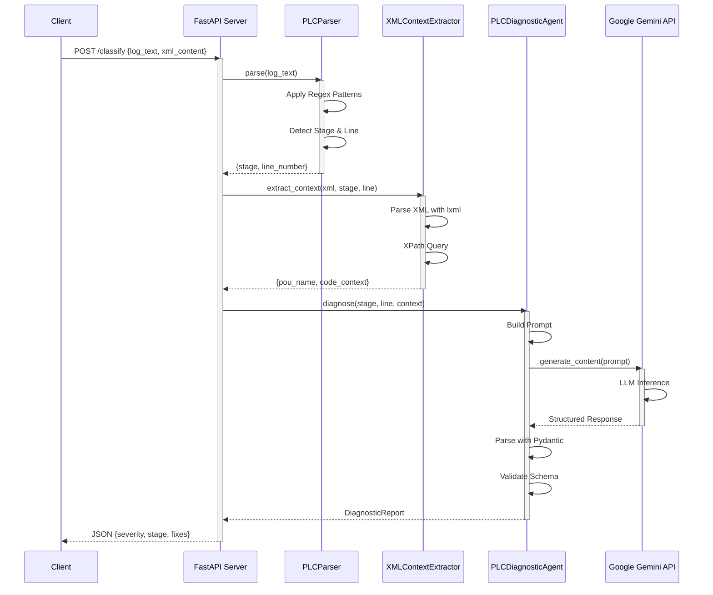
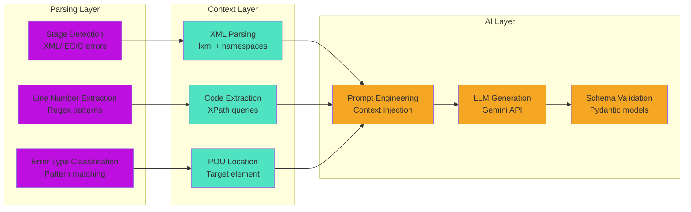
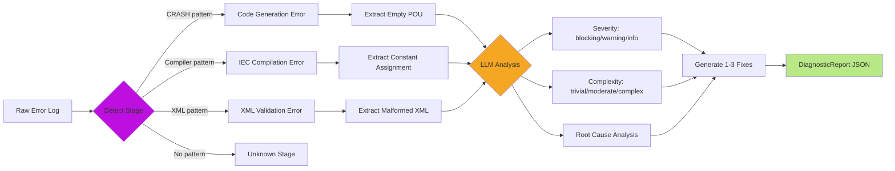
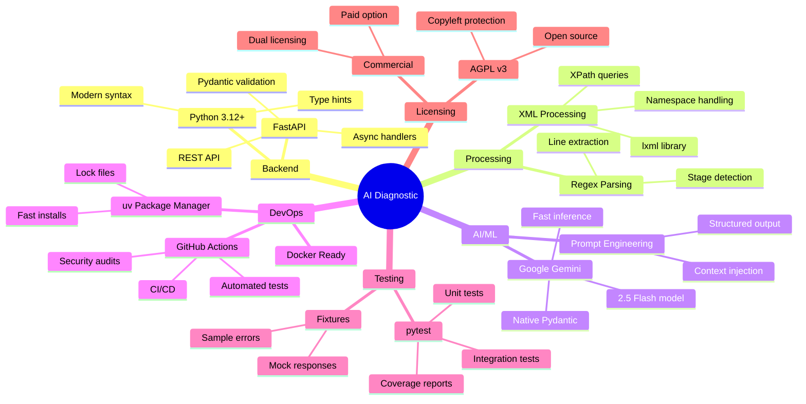
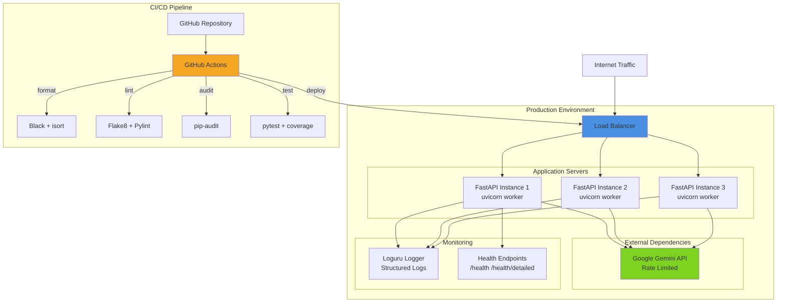
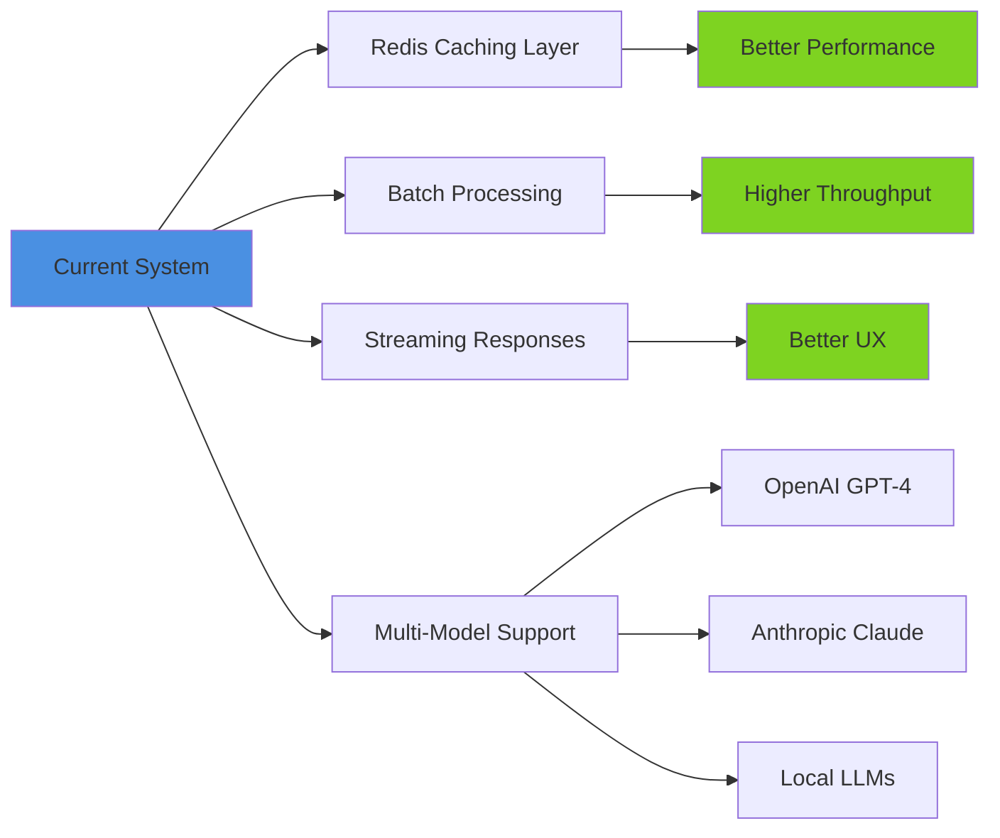

# AI PLC Diagnostic System - Architecture

## System Architecture

```mermaid
graph TB
    subgraph "Client Layer"
        Client[HTTP Client/cURL]
    end

    subgraph "API Layer - FastAPI"
        API[/classify Endpoint]
        Health[/health Endpoint]
    end

    subgraph "Core Processing"
        Parser[PLCParser<br/>Regex-based Error Detection]
        XMLExtractor[XMLContextExtractor<br/>XPath Context Retrieval]
        Agent[PLCDiagnosticAgent<br/>LLM-Powered Analysis]
    end

    subgraph "External Services"
        Gemini[Google Gemini 2.5 Flash<br/>LLM Inference]
    end

    subgraph "Data Models"
        Schema[Pydantic Schemas<br/>DiagnosticReport]
    end

    subgraph "Input Data"
        ErrorLog[Error Log Text<br/>Multi-stage PLC errors]
        XML[PLCopen XML<br/>Project source code]
    end

    Client -->|POST /classify| API
    Client -->|GET /health| Health
    
    API --> Parser
    API --> XMLExtractor
    
    Parser -->|Stage, Line Number| Agent
    XMLExtractor -->|Code Context| Agent
    
    Agent -->|Prompt Engineering| Gemini
    Gemini -->|Structured Response| Agent
    
    Agent -->|Validate| Schema
    Schema -->|JSON Response| API
    API -->|HTTP 200| Client
    
    ErrorLog -.->|Input| Parser
    XML -.->|Input| XMLExtractor

    style API fill:#4A90E2
    style Agent fill:#F5A623
    style Gemini fill:#7ED321
    style Parser fill:#BD10E0
    style XMLExtractor fill:#50E3C2
    style Schema fill:#B8E986
```

## Data Flow



## Component Responsibilities



## Error Classification Pipeline



## Technology Stack



## Deployment Architecture



## Key Design Decisions

| Decision | Rationale | Trade-off |
|----------|-----------|-----------|
| **Deterministic Parsing First** | Reduces LLM calls, faster response | Requires maintained regex patterns |
| **Google Gemini 2.5 Flash** | Fast inference (4-10s), native Pydantic | Vendor lock-in, rate limits |
| **XPath Context Extraction** | Precise code targeting, reduced tokens | Requires valid XML structure |
| **Pydantic Schemas** | Type safety, auto validation, OpenAPI docs | Schema evolution overhead |
| **AGPL v3 + Commercial** | Community contributions + revenue model | Legal complexity |
| **Single Binary Deployment** | Simple ops, no DB needed | Stateless only |

## Performance Characteristics

- **Response Time**: 5-10s average (LLM inference bound)
- **Accuracy**: 100% stage/severity/complexity classification
- **Confidence**: 0.97+ average for fix suggestions
- **Throughput**: Limited by Gemini API rate limits
- **Scalability**: Horizontal scaling ready (stateless)

## Future Enhancements


